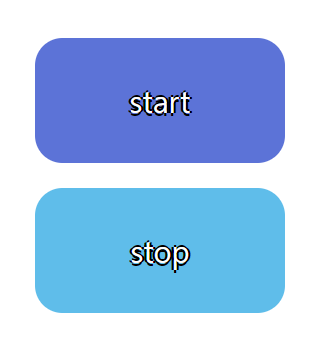

# # atomic component 구현하기

---

#### start, stop 버튼 구현

##### - [피그마 시안 바로가기](https://www.figma.com/file/VUs4v5WUWa5Lqs09fo3K51/%EC%95%84%ED%86%A0%EB%AF%B9-%EC%BB%B4%ED%8F%AC%EB%84%8C%ED%8A%B8-%EA%B3%BC%EC%A0%9C---%EB%B2%84%ED%8A%BC-%EB%A7%8C%EB%93%A4%EA%B8%B0?type=design&node-id=0%3A1&mode=design&t=j48XxyKFuPFP6Grc-1)

---

#### <결과물>



---

### 구현 코드

#### StartButton.jsx

```js
function StartButton({ label }) {
  return (
    <button
      type="submit"
      className={`${styles.button} ${styles.primaryColor}`}
      aria-label={label}
      title={label}
    >
      start
    </button>
  );
}

export default StartButton;
```

#### StopButton.jsx

```js
function StopButton({ label }) {
  return (
    <button
      type="submit"
      className={`${styles.button} ${styles.secondaryColor}`}
      aria-label={label}
      title={label}
    >
      stop
    </button>
  );
}

export default StopButton;
```

#### HeaderBar.jsx

```js
function HeaderBar() {
  return (
    <header>
      <StartButton label="시작" />
      <StopButton label="멈춤" />
    </header>
  );
}

export default HeaderBar;
```

---

#### 아쉬운 점 및 느낀점

- color의 값을 조건처리를 통해 색상을 변경해주고 싶었지만 리액트에 익숙치 않아 style 로 지정해준 부분이 아쉽다
- 리액트를 처음 배우고 스스로 컴포넌트를 만들어봤는데 아직 많이 미숙한 것 같다.
  그래도 만들어보면서 여러개로 쪼갠 컴포넌트를 어떻게 랜더링 하는지와 module.css의 사용 방식에 대해 조금이나마 알게 된 것 같다!
